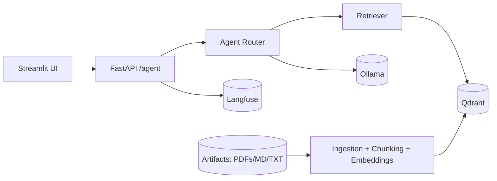

GenAI Delivery Assistant
========================

Agentic, retrieval-augmented assistant for consulting delivery. It answers questions
from project artifacts and produces structured outputs (ADR, solution outline, user
stories, risk assessment) with citations and guardrails.

Why this demo
-------------
- End-to-end RAG with local LLM (Ollama) and vector DB (Qdrant)
- Agentic tool routing with structured outputs
- Guardrails (schema validation + PII redaction + citation enforcement)
- Evaluation (RAGAS + router tool accuracy)
- Observability with Langfuse

Key features
------------
- Ingestion: PDF / Markdown / TXT
- Chunking: Markdown-aware + recursive splitting
- Retrieval: similarity, MMR (default), or hybrid
- Answers with citations or refusal
- Structured JSON outputs (ADR, solution outline, user stories, risk assessment)
- PII redaction (best-effort, demo-grade)
- Langfuse traces and tags
- RAGAS and router evaluation

Architecture
------------


See docs for more: `docs/architecture.md`

Quickstart
----------
1) Copy environment template:
   ```bash
   cp .env.example .env
   ```
2) Start core services:
   ```bash
   docker compose up -d
   ```
3) Ingest data:
   ```bash
   curl -X POST http://localhost:8000/ingest
   ```
4) Open UI:
   - http://localhost:8501

Data layout
-----------
- `data/` is ingested recursively.
- Files under `data/external/` are tagged as `doc_type=external`.
- Files under the rest of `data/` are tagged as `doc_type=project`.

Observability (optional)
------------------------
Start Langfuse stack:
```bash
docker compose --profile obs up -d
```
Langfuse UI: http://localhost:3000

Evaluation
----------
- RAGAS:
  ```bash
  make eval
  ```
  Output: `app/eval/results.json`
- Router accuracy:
  ```bash
  make eval-router
  ```
  Output: `app/eval/router_eval_results.json`

Retrieval modes
---------------
- Default: MMR
- Override per request using UI dropdown or header:
  - Headers:
    - `X-Retrieval-Mode: mmr|hybrid|similarity`
    - `X-Doc-Scope: project|external|all`
    - `X-Retrieval-K: <int>`
- Env options:
  - `RETRIEVAL_MODE=mmr|hybrid|similarity`
  - `RETRIEVAL_K=6` (default top-k when no header override is sent)
  - `DOC_SCOPE=project|external|all`
  - `MMR_FETCH_K=24`, `MMR_LAMBDA=0.5`
  - `HYBRID_FETCH_K=24`, `HYBRID_ALPHA=0.7`
  - `SIMILARITY_FETCH_K=24`
  - `IDENTIFIER_FETCH_K=500`, `IDENTIFIER_BOOST=0.2` (for queries like `LLM06`)

Guardrails and safety
---------------------
- Schema validation with GuardrailsAI (fallback to Pydantic)
- PII redaction (regex-based; best-effort demo)
- Refuse if missing/invalid citations or insufficient context

Security note
-------------
- Demo artifacts are synthetic. Do not ingest real customer data.
- PII redaction is best-effort and may miss edge cases.

Health checks
-------------
- Liveness: `GET /health`
- Readiness: `GET /ready` (checks env + Ollama + Qdrant)

Developer tools
---------------
- Lint: `make lint`
- Tests (container): `docker compose exec api pytest -q`
- Tests (host, if deps installed): `make test`
- Debug API with VS Code: `make debug` and attach to port 5678

Debug endpoints
---------------
- `GET /debug/retrieval` (inspect retrieved chunks/scores for a query)
- `GET /debug/qdrant` (inspect collection samples and payload keys)
- `GET /debug/langfuse` (check SDK auth wiring)

Demo checklist
--------------
See `docs/demo_checklist.md`.

Examples and FAQ
----------------
- Examples: `docs/examples/`
- Demo FAQ: `docs/demo_faq.md`
- Demo questions: `docs/demo_questions.md`

Notes
-----
- Changing embeddings requires re-ingest.
- PDF extraction quality depends on PDF text extractability.
