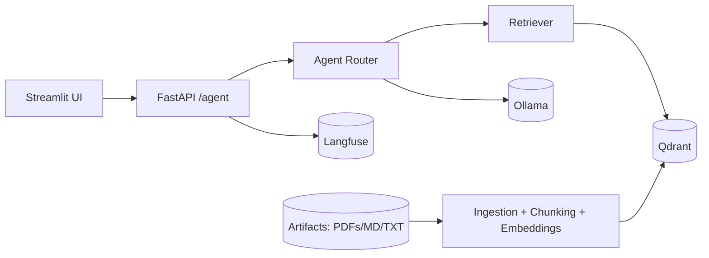

Architecture Overview
=====================

High-level flow
---------------

Key components
--------------
- FastAPI: single entrypoint `/agent`
- Router: tool selection and guardrails
- Qdrant: vector search
- Ollama: local LLM
- Langfuse: traces and prompt inspection

Data flow
---------
1) User submits request to `/agent`.
2) Router selects tool and retrieves context.
3) LLM generates output with citations.
4) Guardrails validate and redact PII.
5) Response returned to UI with tool metadata.
